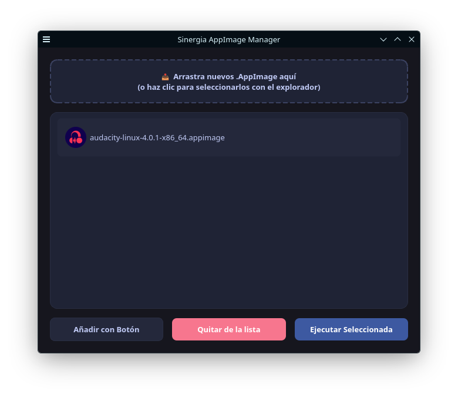

# Sinergia AppImage Manager



Un gestor moderno y oscuro de AppImages para Linux con integración nativa.

## Características

* **Diseño Moderno y Oscuro:** Interfaz elegante y minimalista desarrollada con PyQt6.

* **Integración con el Sistema:** Gestión automática de accesos directos (`.desktop`) e iconos escalables en el directorio del sistema.

* **Ligero y Eficiente:** Pensado para un rendimiento óptimo.

## Instalación

### Desde el AUR (Arch Linux)

Puedes instalarlo utilizando tu ayudante de AUR favorito (`yay`, `paru`, etc.):

```
yay -S sinergia-appimage-manager

```

```
paru -S sinergia-appimage-manager

```

## Uso

Una vez instalado, puedes iniciar directamente desde el lanzador de aplicaciones de tu escritorio o ejecutando en la terminal 

```
appimage-manager
```

 

## Licencia

Este proyecto está bajo la licencia [GPL3](LICENSE).
